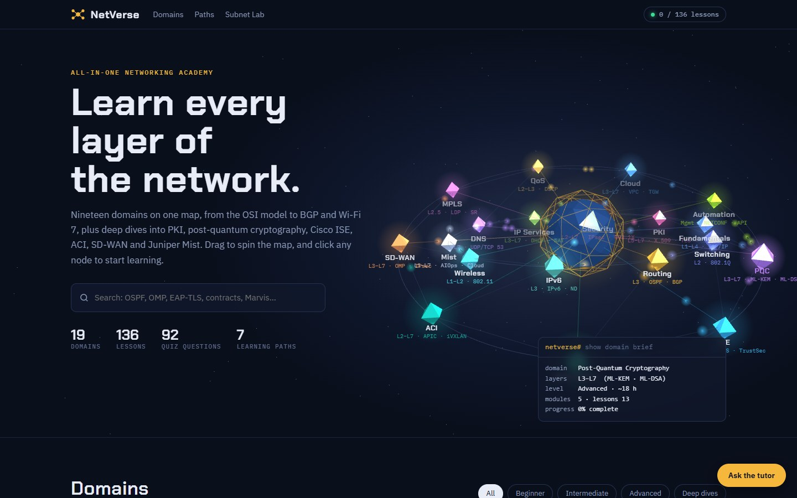
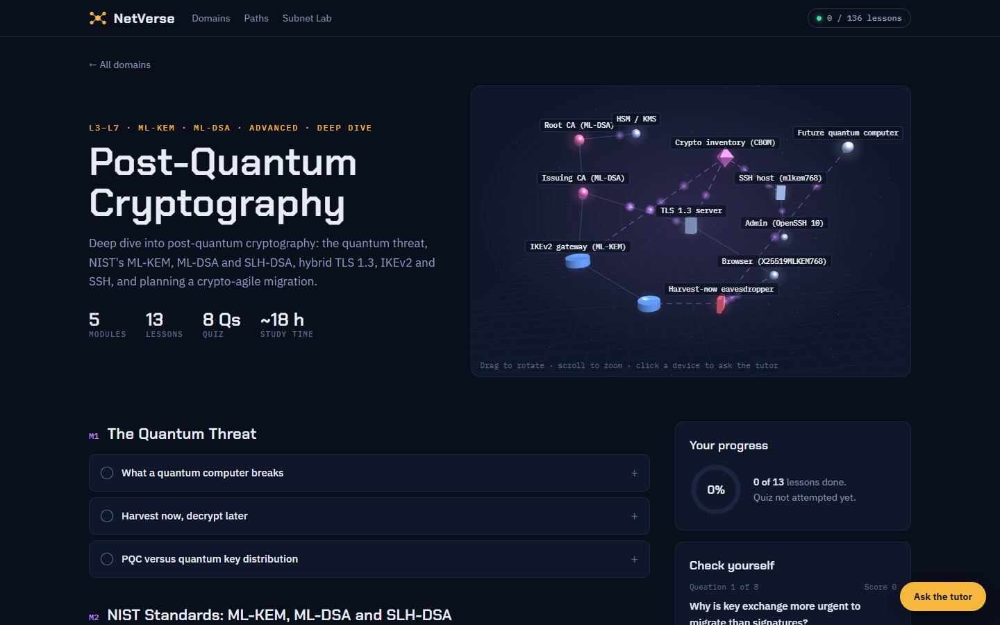
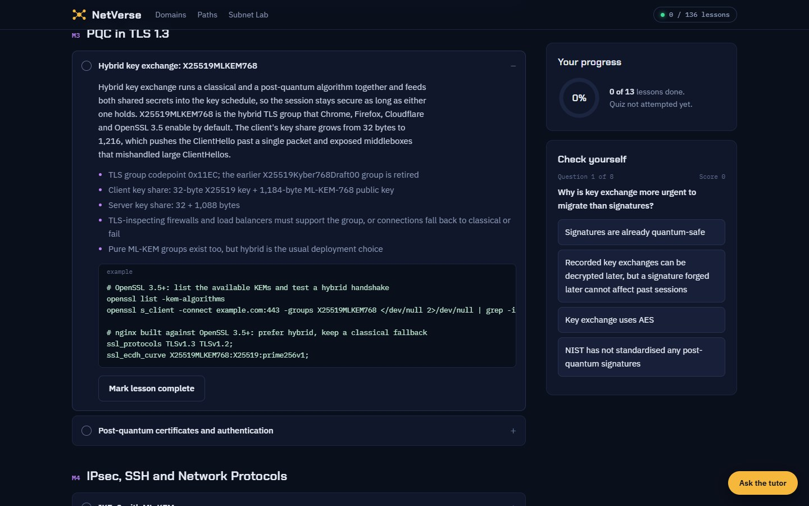
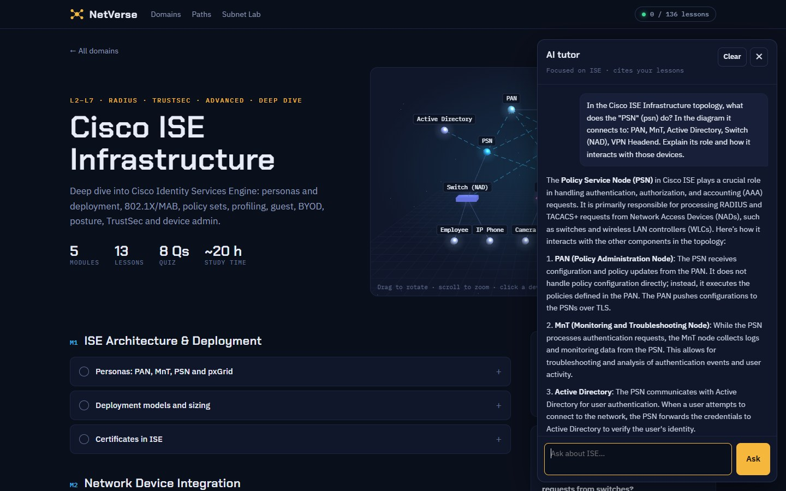
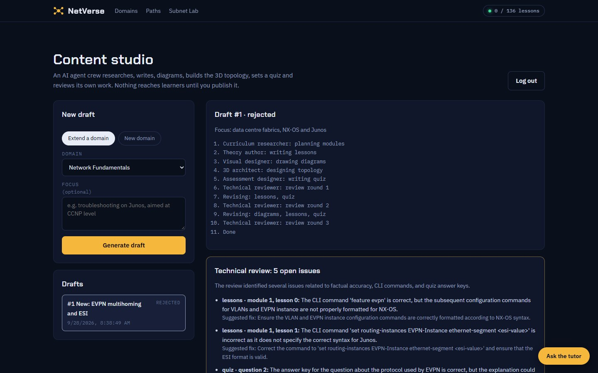
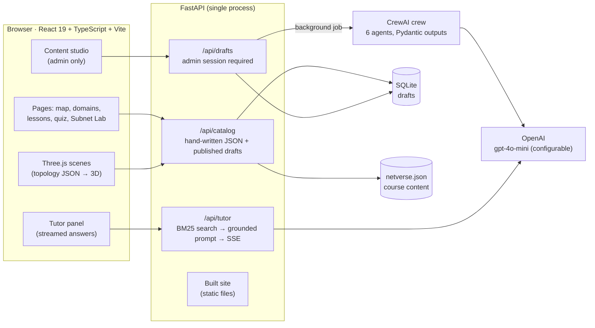
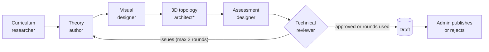

<div align="center">

# NetVerse Academy

**An AI-powered, 3D learning platform for network engineering.**

Nineteen networking domains live on an interactive 3D map. Every domain has its own animated 3D topology, structured lessons with real CLI, quizzes, and an AI tutor that answers from the course and explains any device you click.

[](https://github.com/natrajexplore/Gen-AI-program/actions/workflows/ci.yml)
[](LICENSE)




</div>

---

## Contents

- [Highlights](#highlights)
- [Screenshots](#screenshots)
- [Curriculum](#curriculum)
- [Architecture](#architecture)
- [AI features](#ai-features)
- [Getting started](#getting-started)
- [Configuration](#configuration)
- [Deployment](#deployment)
- [Testing and CI](#testing-and-ci)
- [Authoring content](#authoring-content)
- [API reference](#api-reference)
- [Security](#security)
- [Project structure](#project-structure)
- [Roadmap](#roadmap)
- [Contributing](#contributing)
- [License](#license)

## Highlights

| | |
| --- | --- |
| 🌐 **3D domain map** | Every domain is a node on a live network map. Drag to spin, hover for a CLI-style brief, click to open. |
| 🛰️ **3D topology per domain** | Data-driven scenes (spine-leaf fabrics, SD-WAN overlays, ISE deployments, PKI chains…) with packets moving along the links. |
| 📚 **136 lessons, 92 quiz questions** | Organised into modules with key points, 35 real CLI/config examples, Mermaid diagrams and instant quiz feedback. |
| 🔬 **Six deep dives** | Juniper Mist AI, PKI, Post-Quantum Cryptography, Cisco ISE, Cisco ACI and SD-WAN, with 5–6 modules each. |
| 🧭 **Seven learning paths** | Career tracks from Network Associate to Security Engineer that light up as you finish each domain. |
| 🤖 **AI tutor** | Streamed answers grounded in the lessons, with clickable citations. Click any device in a topology to have it explained. |
| 🏗️ **AI content studio** | A six-agent CrewAI crew drafts new modules or whole domains (lessons, diagrams, 3D topology, quiz) and reviews its own work. You publish. |
| 🧮 **Subnet Lab** | IPv4 CIDR calculator with a binary view of network and host bits. |
| 🔎 **Full-text search** | Across every lesson, key point and CLI snippet. |
| 🚀 **Deploy-ready** | One Docker image, admin login, rate limits, and CI on every push. |

## Screenshots

<table>
  <tr>
    <td width="50%"><br><sub><b>Deep dive with a 3D topology.</b> Post-Quantum Cryptography: ML-DSA CA chain, hybrid TLS and IKEv2 peers, and a harvest-now eavesdropper.</sub></td>
    <td width="50%"><br><sub><b>Lessons with real CLI.</b> Key points plus tested OpenSSL and nginx configuration for hybrid X25519MLKEM768.</sub></td>
  </tr>
  <tr>
    <td width="50%"><br><sub><b>Explain this node.</b> Clicking the PSN in the Cisco ISE scene asks the tutor, with the device's links as context.</sub></td>
    <td width="50%"><br><sub><b>Content studio.</b> The agent crew's step log and the technical reviewer's open issues, before anything is published.</sub></td>
  </tr>
</table>

## Curriculum

| Domain | Level | Layers | Modules | Lessons | Quiz |
| --- | --- | --- | :-: | :-: | :-: |
| Network Fundamentals | Beginner | L1–L4 | 3 | 6 | 4 |
| Switching & VLANs | Beginner | L2 | 3 | 5 | 4 |
| Routing Protocols (static, OSPF, EIGRP, BGP) | Intermediate | L3 | 3 | 6 | 4 |
| IPv6 | Intermediate | L3 | 3 | 4 | 3 |
| Wireless (RF, Wi-Fi 6/7, WLC, WPA3) | Intermediate | L1–L2 | 3 | 5 | 4 |
| **Juniper Mist AI** · deep dive | Advanced | L1–L7 | 5 | 11 | 7 |
| DNS (resolution, records, DNSSEC, DoH/DoT) | Beginner | L7 | 3 | 4 | 4 |
| IP Services (DHCP, NAT, NTP, SNMP, FHRP) | Beginner | L3–L7 | 2 | 4 | 3 |
| Network Security (ACLs, NGFW, IPsec, 802.1X, Zero Trust) | Intermediate | L2–L7 | 3 | 6 | 4 |
| **PKI & Certificates** · deep dive | Advanced | L5–L7 | 5 | 10 | 7 |
| **Post-Quantum Cryptography** · deep dive | Advanced | L3–L7 | 5 | 13 | 8 |
| **Cisco ISE Infrastructure** · deep dive | Advanced | L2–L7 | 5 | 13 | 8 |
| Data Centre (spine-leaf, VXLAN/EVPN, storage) | Advanced | L2–L3 | 3 | 6 | 4 |
| **Cisco ACI Data Centre** · deep dive | Advanced | L2–L7 | 6 | 13 | 8 |
| **SD-WAN Concepts** · deep dive | Advanced | L3–L7 | 5 | 15 | 8 |
| MPLS & Service Provider (L3VPN, SR) | Advanced | L2.5 | 3 | 4 | 3 |
| Quality of Service | Intermediate | L2–L3 | 2 | 3 | 3 |
| Cloud Networking (VPC, transit, Kubernetes) | Intermediate | L3–L7 | 2 | 4 | 3 |
| Network Automation (YANG, NETCONF, Ansible) | Intermediate | Mgmt | 2 | 4 | 3 |
| **Total** | | | **66** | **136** | **92** |

### Learning paths

| Path | Focus | Steps |
| --- | --- | --- |
| Network Associate | CCNA-level foundation | Fundamentals → Switching → Routing → IP Services → Wireless → Security → Automation |
| Enterprise & Campus | CCNP ENCOR-style depth | Switching → Routing → Wireless → Mist → QoS → SD-WAN → ISE |
| Data Centre & Cloud | Fabrics to hyperscalers | Routing → Data Centre → ACI → Cloud → Automation |
| Identity & Zero Trust | PKI, NAC and segmentation | Security → PKI → ISE → SD-WAN → Cloud |
| AI-Driven Wireless Campus | Wi-Fi to cloud-managed AIOps | Wireless → PKI → ISE → Mist |
| Service Provider | Carrier-grade transport | Routing → IPv6 → MPLS → QoS |
| Security Engineer | Defence in depth | Fundamentals → DNS → Security → PKI → PQC → ISE → SD-WAN → Cloud |

## Architecture



| Layer | Technology |
| --- | --- |
| Frontend | React 19, TypeScript, Vite, Three.js (WebGL), Mermaid |
| Backend | FastAPI, Pydantic v2, Uvicorn, SQLite |
| AI | CrewAI (content crew), OpenAI SDK (tutor streaming), built-in BM25 retrieval |
| Tooling | uv (Python), npm, oxlint, pytest, Docker, GitHub Actions |

**Design choices**

- **Content is data.** Lessons, quizzes, paths and every 3D topology live in one validated JSON file. The renderer draws any topology from JSON, which is what lets an AI agent design new 3D scenes.
- **Nothing AI-generated goes live unreviewed.** Studio output is stored as drafts and layered onto the catalogue only when an admin publishes it. The hand-written file is never modified.
- **Grounded tutoring.** The tutor retrieves the most relevant lessons first and must cite them, so answers stay tied to the course.

## AI features

### AI tutor

Open it with **Ask the tutor** (bottom right, every page).

1. Your question is matched against every lesson, including published drafts, with a built-in BM25 search. Lessons from the domain you are viewing are boosted.
2. The top five lessons go to the model as numbered excerpts, with instructions to cite them and never to invent CLI.
3. The answer streams back. Citations such as [1] and the source list link straight to the lesson.
4. Anything the course doesn't cover is labelled *(not covered in the course)*.

**Explain this node:** click any device in a domain's 3D topology. The tutor gets the device's name and type plus the devices it connects to in that scene, and explains its role.

### Content studio

Open **Content studio** from the footer (`#studio`) and log in with `ADMIN_PASSWORD`. Choose **Extend a domain** or **New domain**, add an optional focus, and generate. A draft takes about two minutes.


<sub>* new domains only</sub>

| Agent | Produces |
| --- | --- |
| Curriculum researcher | A 2–3 module outline (plus catalogue metadata for a new domain) |
| Theory author | Lessons with key points and vendor CLI (left out when not certain) |
| Visual designer | Mermaid diagrams for the lessons that need them |
| 3D topology architect | A validated `topology` for a new domain's 3D scene |
| Assessment designer | 5–7 quiz questions with explanations |
| Technical reviewer | A verdict with specific issues, each routed back to the agent that owns it |

Every agent returns Pydantic-validated JSON. Invalid output is sent back to the agent once with the validation error.

> [!IMPORTANT]
> The default model (`gpt-4o-mini`) is fast and costs a few cents per draft, but it can still get vendor CLI and protocol details wrong, and the reviewer is an AI too. Read every draft and its open review issues before publishing. Set `NETVERSE_MODEL` to a stronger model for higher accuracy.

## Getting started

### Prerequisites

- [Python 3.11+](https://www.python.org/) and [uv](https://docs.astral.sh/uv/)
- [Node.js 24+](https://nodejs.org/) and npm
- An [OpenAI API key](https://platform.openai.com/) (optional: only the tutor and the content studio need it)

### Run locally

```bash
git clone https://github.com/natrajexplore/Gen-AI-program.git
cd Gen-AI-program
cp .env.example .env          # then fill in the values you need

# terminal 1: API on http://127.0.0.1:8005
cd backend
uv sync
uv run uvicorn app.main:app --reload --port 8005

# terminal 2: frontend on http://localhost:5005 (proxies /api to the backend)
cd frontend
npm install
npm run dev
```

Open **http://localhost:5005**. The site works without any keys; the tutor and studio show a clear message until they are configured.

## Configuration

All settings are environment variables, read from `.env` in the project root (see [`.env.example`](.env.example)).

| Variable | Default | Purpose |
| --- | --- | --- |
| `OPENAI_API_KEY` | — | Required for the AI tutor and the content studio |
| `NETVERSE_MODEL` | `gpt-4o-mini` | Model used by the tutor and the agent crew |
| `ADMIN_PASSWORD` | — | Content studio login. Empty disables the studio |
| `SESSION_SECRET` | random per start | Signs admin session cookies. Use 64 random hex characters |
| `COOKIE_SECURE` | `false` | Set `true` when serving over HTTPS |
| `TUTOR_RATE_LIMIT` | `20` | Tutor questions allowed per client IP per window |
| `TUTOR_RATE_WINDOW` | `600` | Tutor rate-limit window, in seconds |
| `FORWARDED_ALLOW_IPS` | `127.0.0.1` | Behind a reverse proxy: the proxy's IP, so limits see real client IPs |
| `STATIC_DIR` | `frontend/dist` | Built site served by FastAPI |

Generate a session secret with:

```bash
python -c "import secrets; print(secrets.token_hex(32))"
```

## Deployment

In production FastAPI serves both the API and the built site on a single port.

### Docker

```bash
docker build -t netverse .
docker run -d --name netverse -p 8000:8000 \
  --env-file .env \
  -v netverse-data:/app/backend/data \
  netverse
# open http://localhost:8000
```

The image builds the frontend with Node, then runs the API on a slim Python image as a non-root user. Secrets come from `--env-file` and are never baked into the image. The `netverse-data` volume keeps the drafts database, including published AI content.

### Without Docker

```bash
cd frontend && npm ci && npm run build
cd ../backend && uv sync --no-dev && uv run uvicorn app.main:app --host 0.0.0.0 --port 8000
```

### Production checklist

- [ ] Serve over HTTPS (Caddy, nginx or a cloud load balancer) and set `COOKIE_SECURE=true`
- [ ] Set a strong `ADMIN_PASSWORD` and a 64-character random `SESSION_SECRET`
- [ ] Behind a reverse proxy, set `FORWARDED_ALLOW_IPS` to the proxy's address
- [ ] Set a monthly spending limit on your OpenAI account: the tutor is public (rate-limited per IP)
- [ ] Run a single server process (rate limits are kept in memory)
- [ ] Back up the `/app/backend/data` volume
- [ ] Ship `third-party-licenses.md` from the build output with the site

## Testing and CI

```bash
cd backend && uv run pytest          # 29 tests, no API key needed (model calls are stubbed)
cd frontend && npm run lint && npm run build
```

The backend suite covers the catalogue and topology validation, draft lifecycle and publishing, tutor retrieval and streaming, admin sessions (including forged, expired and rotated tokens), both rate limits, and serving the built site.

[GitHub Actions](.github/workflows/ci.yml) runs on every push to `main` and every pull request:

| Job | Steps |
| --- | --- |
| backend | `uv sync --frozen`, `pytest` |
| frontend | `npm ci`, lint, build, `npm audit` (high severity fails the build) |
| docker | full image build |

## Authoring content

All course content lives in [`backend/app/content/netverse.json`](backend/app/content/netverse.json) and is validated against the Pydantic schema in [`backend/app/models.py`](backend/app/models.py) when the API starts.

**Lesson**

```json
{
  "t": "Hybrid key exchange: X25519MLKEM768",
  "body": "Hybrid key exchange runs a classical and a post-quantum algorithm together…",
  "points": ["TLS group codepoint 0x11EC", "Client key share: 32 + 1,184 bytes"],
  "cli": "openssl s_client -connect example.com:443 -groups X25519MLKEM768",
  "diagram": "sequenceDiagram\n  Client->>Server: ClientHello (key shares)"
}
```

`cli` and `diagram` (Mermaid source) are optional.

**Domain:** add an object to `domains` with a unique `id`, `name`, `short` label, accent `color`, `level`, `layers`, `proto`, `hours`, `tagline`, `modules`, `quiz` and a `topology`. Set `"deep": true` for a deep dive. It appears automatically on the 3D map, in the grid, in search and in the tutor's index.

**Topology**

```json
{
  "nodes": [
    { "id": "router-1", "kind": "router", "label": "PE", "pos": [0, 1.2, 0] },
    { "id": "switch-1", "kind": "switch", "label": "Access", "pos": [2, -0.5, 0.4] }
  ],
  "links": [{ "from": "router-1", "to": "switch-1", "style": "dashed" }],
  "effects": [{ "type": "radio", "nodes": ["ap-1"] }, { "type": "shells", "radii": [1.9, 3.6] }]
}
```

| Field | Rules |
| --- | --- |
| `kind` | Shape and colour: `core`, `router`, `switch`, `spine`, `leaf`, `server`, `host`, `ap`, `client`, `dns`, `fw`, `cloud`, `hub`, `branch`, `controller`, `ca`, `ocsp`, `psn`, `pan`, `idstore`, `apic`, `epg`, `ai` |
| `pos` | `[x, y, z]` with x and z in −5…5 and y in −3…3.5, so the scene stays in frame |
| `label` | Up to 24 characters. Only the first node with each label is labelled, so repeat labels to keep busy scenes readable |
| `style` | `solid` (default) for data links, `dashed` (domain colour) for control-plane or logical links |
| `effects` | Optional: `radio` (Wi-Fi rings around nodes) and `shells` (wireframe security zones) |

Links must reference existing nodes. The API rejects invalid topologies at startup, and the studio's 3D agent is held to the same rules.

## API reference

| Method | Path | Auth | Description |
| --- | --- | --- | --- |
| `GET` | `/api/health` | — | Liveness check |
| `GET` | `/api/catalog` | — | Full catalogue: domains, modules, lessons, quizzes, topologies, paths |
| `GET` | `/api/domains/{id}` | — | One domain |
| `POST` | `/api/tutor` | rate-limited | Ask the tutor. Streams server-sent events: `sources`, `delta`…, `done` (or `error`) |
| `POST` | `/api/auth/login` | throttled | Admin login; sets the session cookie |
| `POST` | `/api/auth/logout` | — | Clears the session cookie |
| `GET` | `/api/auth/me` | — | `{ admin, enabled }` |
| `POST` | `/api/drafts` | admin | Start a generation (`mode`: `extend` or `new`) |
| `GET` | `/api/drafts` | admin | List drafts with status and step log |
| `GET` | `/api/drafts/{id}` | admin | Draft with the generated package and review |
| `POST` | `/api/drafts/{id}/publish` | admin | Validate and publish into the catalogue |
| `POST` | `/api/drafts/{id}/reject` | admin | Reject a ready draft |

Interactive docs are available at `/docs` while the API is running.

## Security

- **Admin sessions:** HMAC-SHA256-signed, `HttpOnly`, `SameSite=Strict` cookie scoped to `/api`, 12-hour expiry, compared in constant time.
- **Brute-force protection:** 5 failed logins per 15 minutes per IP; the block is checked before the password.
- **Cost protection:** the public tutor is rate-limited per client IP.
- **No secrets in the repo or image:** `.env` is git-ignored and excluded from the Docker build context.
- **Safe rendering:** Mermaid runs with `securityLevel: "strict"`, and lesson text is rendered as text, not HTML.
- **Supply chain:** npm audit in CI, lock files for both stacks, and third-party actions pinned where upstream recommends it.

## Project structure

```
.
├── backend/
│   ├── app/
│   │   ├── main.py              # FastAPI app: catalogue, tutor, login, drafts; serves the built site
│   │   ├── auth.py              # admin session cookie and per-IP rate limits
│   │   ├── models.py            # Pydantic schema: catalogue, lessons, quizzes, 3D topologies
│   │   ├── tutor.py             # BM25 retrieval, grounded prompt, streamed answers
│   │   ├── store.py             # SQLite storage for drafts
│   │   ├── crew/                # CrewAI agents, output schemas, generation pipeline
│   │   └── content/netverse.json
│   ├── tests/                   # pytest suite (29 tests)
│   └── pyproject.toml, uv.lock
├── frontend/
│   ├── src/
│   │   ├── App.tsx              # hash routing, top bar, catalogue loading
│   │   ├── components/          # Home, DomainView, Quiz, Search, SubnetLab, Tutor, Studio, …
│   │   ├── three/scenes.ts      # Three.js hero map and topology renderer
│   │   └── lib/                 # progress (localStorage), catalogue helpers, subnet maths
│   └── vite.config.ts
├── docs/screenshots/
├── .github/workflows/ci.yml
├── Dockerfile, .dockerignore, .env.example
├── LICENSE, THIRD_PARTY_NOTICES.md
└── README.md
```

## Roadmap

- [ ] **Learner accounts:** progress and quiz scores stored server-side and synced across devices, so the tutor can adapt to what each learner has finished
- [ ] **Higher-accuracy AI content:** stronger models for the author and reviewer, automatic Mermaid and topology checks, human sign-off for CLI
- [ ] **Interactive 3D labs:** step-by-step protocol animations (OSPF DR election, TLS 1.3 handshake, 802.1X) driven by data like the topologies
- [ ] **Slimmer Docker image:** trim CrewAI's optional dependencies (vector stores and ML runtimes the app doesn't use)

## Contributing

1. Create a branch from `main`.
2. Make your change. For content, edit `netverse.json` and restart the API: it validates the file on startup.
3. Run `uv run pytest` in `backend/` and `npm run lint && npm run build` in `frontend/`.
4. Open a pull request. CI must pass.

## License

Released under the [MIT License](LICENSE) © 2026 Nataraj Angappan.

Third-party packages keep their own licenses: see [`THIRD_PARTY_NOTICES.md`](THIRD_PARTY_NOTICES.md). Every `npm run build` writes the full license texts of all bundled packages to `frontend/dist/third-party-licenses.md`; ship that file with the site.
